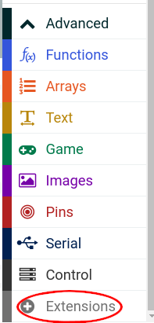
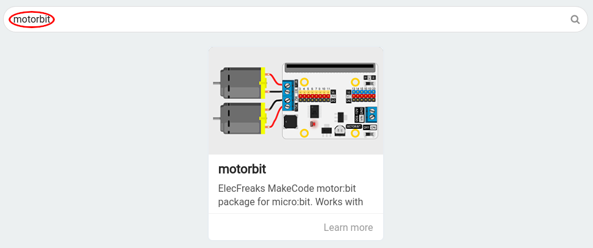

== The Motor:Bit extension

To use the Motor:Bit, we need to load a Blocks extension.
Under Advanced, click Extensions.

Then type `motorbit` into the search box and click the magnifying glass to search.
The search should find the Motor:Bit extension.
Click on the extension to load it.

