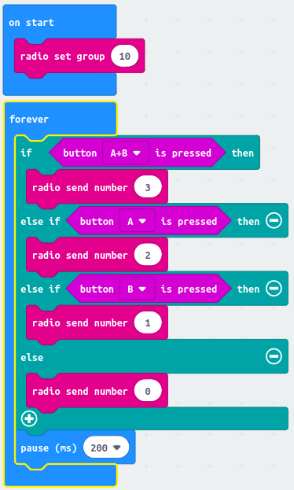
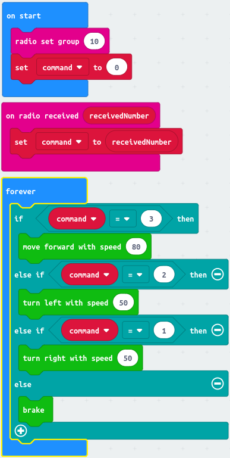

= Radio controlled car

include::../CarCommon/CarAbout.adoc[]

In this project we use two Micro:Bits to make a radio controlled car.

The controls will be very simple.
Press Button A to turn the left wheel, press Button B to turn the right wheel.
So if you press both buttons together the car will go forward.
If you don't press any buttons, the car will stop.

== The controller

The controller sends commands by radio to the car.
Each command is a number.

|===
| Number | Meaning

| 0
| Stop

| 1
| Turn right wheel

| 2
| Turn left wheel

| 3
| Turn both wheels

|===

Here's the whole program.

include::../CarCommon/CarExtension.adoc[]

== The car driver

Now here's the car driver program.

