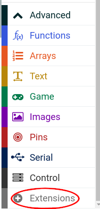

= Radio controlled car

This project uses a Motor:Bit, a little car controlled by a Micro:Bit.
You can find out more about Motor:Bit at
https://www.elecfreaks.com/learn-en/microbitKit/motor_bit_smart_car/index.html.

In this project we use two Micro:Bits to make a radio controlled car.

The controls will be very simple.
Press Button A to turn the left wheel, press Button B to turn the right wheel.
So if you press both buttons together the car will go forward.
If you don't press any buttons, the car will stop.

== The controller

The controller sends commands by radio to the car.
Each command is a number.

|===
| Number | Meaning

| 0
| Stop

| 1
| Turn right wheel

| 2
| Turn left wheel

| 3
| Turn both wheels

|===

Here's the whole program.

== The car driver

This program listens for commands from the controller and does what the command says.

First, though, we need to load an extension.
Under Advanced, click Extensions.

Then type `motorbit` into the search box and click the magnifying glass to search.
The search should find the Motor:Bit extension.
Click on the extension to load it.

Now here's the car driver program.

