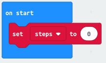
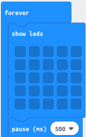

= MicroFitBit, part 1

Once of the most important things a fitness tracker like a FitBit can do is to count
the number of steps you walk evey day.

A Micro:Bit has all the inputs you need to do this. So, let's see if we can make
Micro:Bit into a simple fitness tracker that counts the number of steps you walk.
A MicroFitBit!

== Let's think about what we want to do!

When you're trying to write a program to do something, the best thing to do
is always to break the problem into pieces. What pieces can we break this into?

Well, someone using a fitness tracker to count the number of steps they walk every day
wants the tracker to do two things:

1. Count the number of steps.
2. Show them how many steps they have walked.

So, we're going to have to figure out how to do both of these things. Working out
how to use a Micro:Bit to count steps sounds like it might be a bit complicated, so let's
start by seeing if we can do the simpler thing first.

This is always a good idea. Solving
complicated problems isn't easy, and you need to really understand your problem well.
The best way to start understanding a complicated problem is to work on solving a bit of
it; it helps you explore the problem and also hopefully do something useful while you
explore!

So, let's think about how to show the count of steps walked.
We can try out our solution by writing a program to show a count of the number of
times we press a button.

== Showing the step count

So, what would be a good way to show the step count?

Well, we could just show the number on the Micro:bit. The problem with this is a Micro:Bit
can only show about 1 digit at a time. If you ask it to display, say, 10, it scrolls
1 and then 0 across its display.

So, it's very difficult to work out what the number is unless you look at the Micro:Bit very
carefully.

But the Micro:Bit has 25 LEDs, arranged in a 5x5 square. How could we use those to
show the step count increasing?

One thing we could do is to light up more and more of the Micro:Bit LEDs as the step
count increases. Can you think of any ideas on how that display might work?

=== One way

One way to show the step count would be to use the 5 rows of LEDs to show the units,
tens, hundreds, thousands and tens of thousands counts on the rows. But there's only 5
LEDs on each row, If we lit up an LED on each new step, we'd run out of LEDs in the
first row when we got to 5. So, let's make each LED show 2 steps. The top left LED lights
if you've done 1 or 2 steps, the second lights if you've done 3 or 4 steps and so on.

==== The step counter

We'll keep count of the number of steps by making a variable and keeping the count in
that. Let's call it `steps`. When the Micro:Bit starts running, we'll make sure `steps` starts
at 0.

Now let's add one to the step count when we press button A.

image::steps-increment.png[Add one to steps]

==== The display

We want to keep updating the display. That sounds like a `forever` loop. And we'll need
to make sure all the LEDs are off to begin with. And if we wait for half a second after
clearing the LEDs, before we turn any one, it'll make the display flash. That sounds cool.
Let's do it!

Now, the next bit is a bit complicated. We want to do the same thing on each row, but
for the units on the first row, the tens on the second row and so on.

The LED grid has row 0 at the top, and column 0 at the left. We want to do the same
thing on each row, but for units (ones), tens, hundreds etc. So the number we want
to display on each row is `steps`, `steps` divided by 10, `steps` divided by 100 and
so on.

So let's start by working out the number we want to display on each row.
That's the ones, tens, hundreds etc. bit of the number.
We want a number between 0 and 9.
To work this out, we need a remainder.

image::row-col-count.png[Display loop]

Next, we turn on LED 0 in the row if the number is 1 or more, and also LED 1 if the
number is 3 or more, and also LED 2 if the number of 5 or more, and so on.

Here's the whole thing. It's not easy to understand. But try it and see if it works!

== Ideas

* Can you think of other (less complicated!) ways to show the step count?
