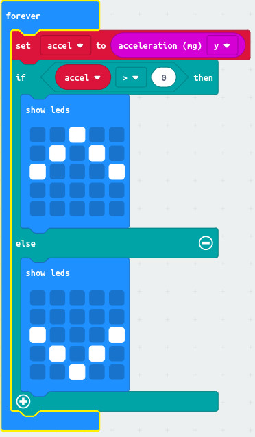
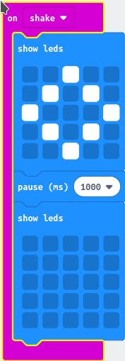

= MicroFitBit, part 2

Now we can count things, the next thing we need to do is to work out how to find
when the person with the Micro:Bit has taken a step.

A device that counts steps is called a _pedometer_.

Can you find any information on how pedometers work?

== Hip motion

The most accurate pedometers are worn on the hip.
Let's start by experimenting with what sort of motion we can see with a Micro:Bit
when we're walking.

The Micro:Bit has an _accelerometer_.
This sense when the Micro:Bit moves in one of 3 ways - left to right (the _x_ direction),
up and down (the _y_ direction) and forwards and back (the _z_ direction).

Maybe when you walk, your hip will go up and down?

Let's write a little Micro:Bit program we can use to try this out.

What happens if you walk around wearing a Micro:Bit running this program on your hip?

This program looks at the _y_ value from the accelerometer.
What happens if you change the program to look at the _x_ value or the _z_ value?

== Hippy hippy shake

You may find that checking the motion using the direct values from the accelerometer
is a bit complicated if you are to tell one sort of motion from another.
Luckily, the Micro:Bit can look out for some types of motion for you and tell you
when they happen.

One sort of motion is can look out for is being shaken.
Try this program instead:

What happens now if you walk around wearing a Micro:Bit running this program on your hip?

What happens if you try the other types of motion that the Micro:Bit provides?
