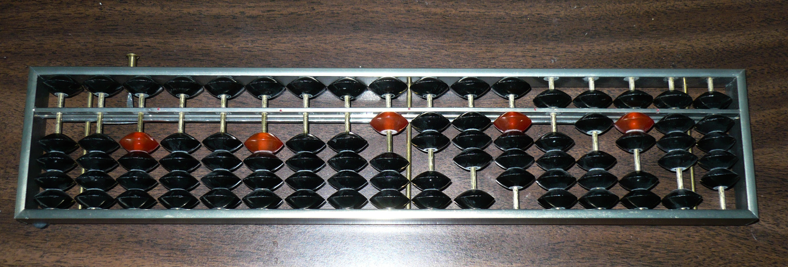
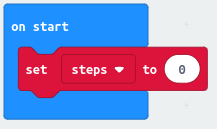
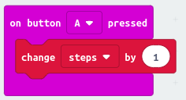
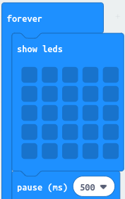
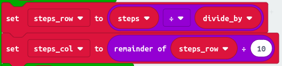
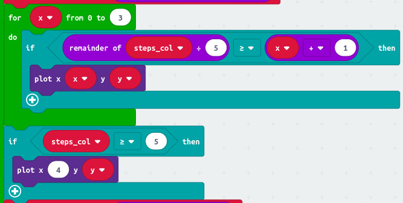
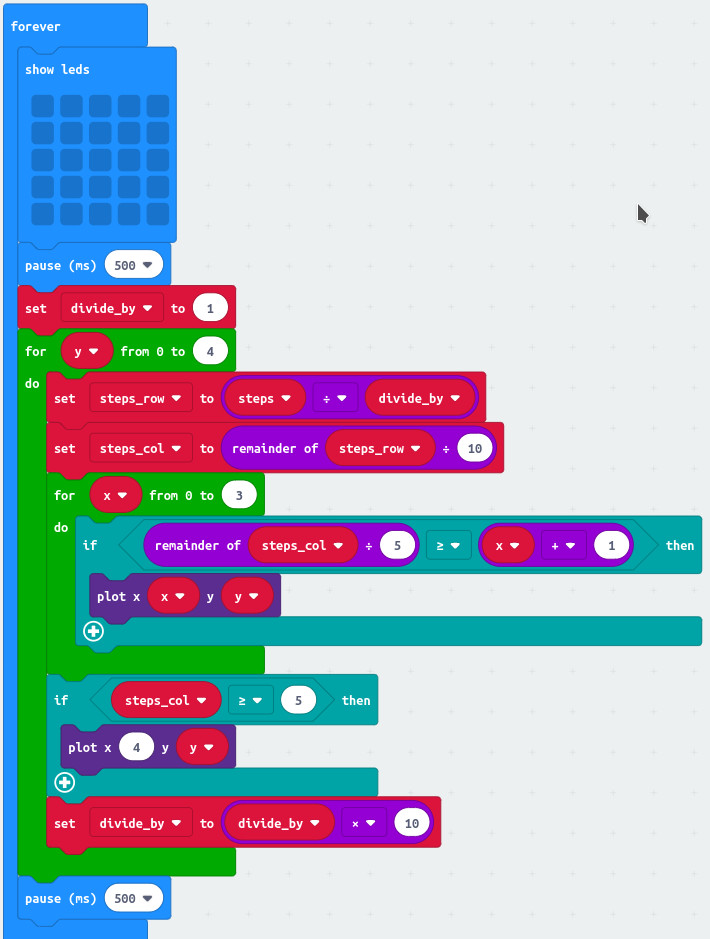

= MicroFitBit, part 1.5

In the last project, we made a Micro:Bit count the number of times we pressed button A.
We showed the current count by flashing the LEDs.
Since we have a grid of 5x5 LEDs, we use each row of the LEDs to show the count
of the units, tens, hundreds, thousands and tens of thousands.
On each row, we counted every other button press.
So we showed a LED on 1, 3, 5, 7 and 9.

The problem with this is that half the time when you press the button, nothing happens!
Might it be better if we could think of another way to show the count that also let us
show small to big numbers, and where something changed on each button press.

== Abacus - an old calculating tool

An *abacus*, also called a *counting frame*, is a calculating tool that was in used
in Europe, China and Russia for centuries before the adoption of the written
Hindu–Arabic numeral system we use today.
The exact origin of the abacus is still unknown.
Today, abacuses are often constructed as a bamboo frame with beads sliding on wires,
but originally they were beans or stones moved in grooves in sand or on tablets of
wood, stone, or metal.

There's a simple type of Chinese abacus called a _soroban_.
Here's a picture of one.

In the picture, the right hand 9 columns of the _soroban_ are set to the digits 1 to 9
(9 is the right-hand column). The other columns show 0.
Can you work out how they show this?

== Showing the step count like a _soroban_

We could do a display like a soroban.
Let's try a display like the last one we did, but using the soroban scheme for each row,
where the left 4 LEDs on the row show digits 1-4, and the right bit tells us to add 5 to
the right 4 LEDs, so we can make the digits 5-9.

=== The step counter

Once again, we'll keep count of the number of steps by making a
variable and keeping the count in that.
Let's call it `steps`.
When the Micro:Bit starts running, we'll make sure `steps` starts at 0.

Now let's add one to the step count when we press button A.

=== The display

We want to keep updating the display. That sounds like a `forever` loop. And we'll need
to make sure all the LEDs are off to begin with. And if we wait for half a second after
clearing the LEDs, before we turn any one, it'll make the display flash. That sounds cool.
Let's do it!

Now, the next bit is a bit complicated. We want to do the same thing on each row, but
for the units on the first row, the tens on the second row and so on.

The LED grid has row 0 at the top, and column 0 at the left. We want to do the same
thing on each row, but for units (ones), tens, hundreds etc. So the number we want
to display on each row is `steps`, `steps` divided by 10, `steps` divided by 100 and
so on.

So let's start by working out the number we want to display on each row.
That's the ones, tens, hundreds etc. bit of the number.
We want a number between 0 and 9.
To work this out, we need a remainder.

OK, so we now know the digit we want to display on the row.
First, the left 4 LEDs show another remainder, this time the remainder when
we divide the digit for this row by 5.
We need to light the first (0th) LED when the remainder is at least 1, the second
when it is at least 2 and so on.
Finally, we need to turn on the 5th LED when the number at 5 or more.

Here's what we do.

Finally, here's the whole `forever` loop. Try it and see if it works!

