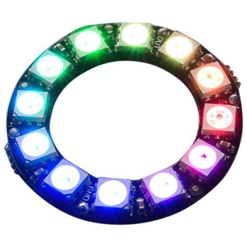
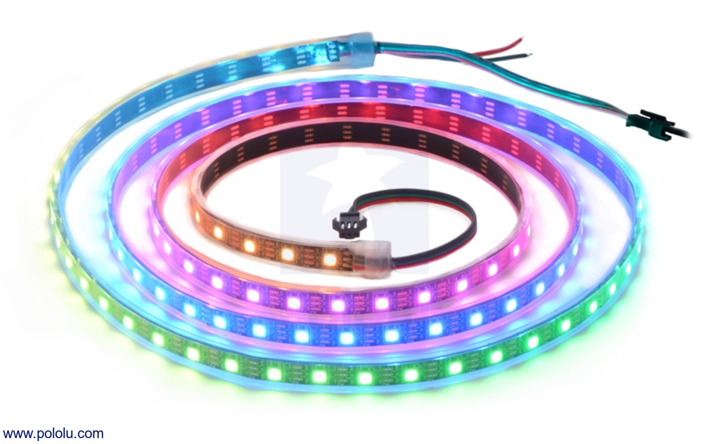
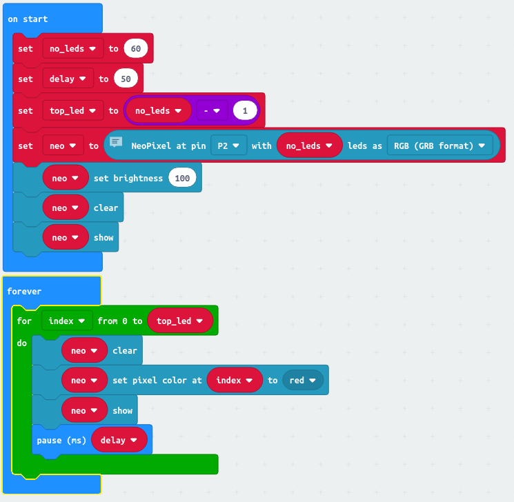
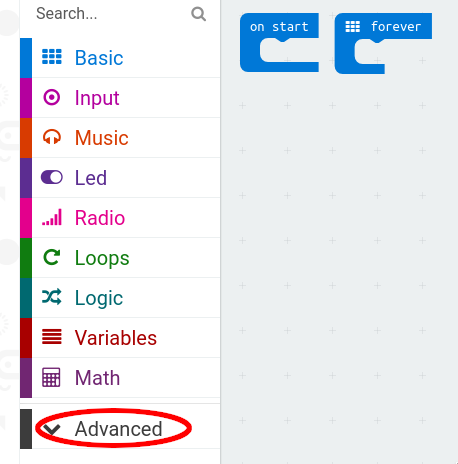
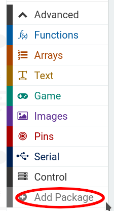
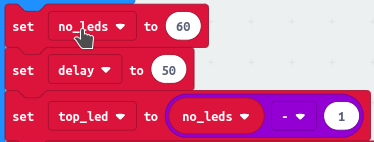
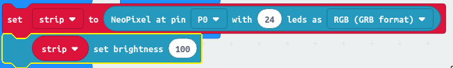

= Fun with Neopixels

Neopixels are devices with coloured LEDs that you can control from your Micro:Bit.
They come in several different shapes and sizes.
The most common are rings and strips like this:

 

== What do you think this program does?

Here's a NeoPixel program to get you started.
If you read the program, can you guess what it does?
Don't worry about the instructions in the `on start` block for now - I'll explain what
they are doing in a moment.

== Coding for Neopixels

=== Adding the Neopixel package to Blocks

To start working with a Neopixel, we need to add the Neopixel module to Blocks.
In a new project, click to show the Advanced items and then Add Package:

 

Finally, choose the AdaFruit NeoPixel driver:

When you've done that, your Blocks editor will have a set of Neopixel instructions.

=== Setting up

The strip or ring has 3 wires.

* One is labelled 5V or +5V. This needs to be connected to the 3V connector on the Micro:Bit.
* One is labelled GND. This needs to be connected to the GND connector on the Micro:Bit.
* One is labelled DI or DIn. This needs to be connected to the 0, 1 or 2 connector on the Micro:Bit.

If you enter the program into the Blocks environment, the Micro:Bit simulator will show the
wires all connected in the right places.

=== Coding

==== Setting up variables

Right at the start of the program at the top of the `on start` block, I'm putting
values in some variables.

Why am I doing this?

Well, the first variable `no_leds` I am using to store the number of individual LEDs on
the Neopixel I am using.
Neopxiel devices have varying numbers of LEDs, and I don't want to have to search
through my program and find every place where I needed to know the number of LEDs
on the device. Also, when I read my program, when I look at a number I want to know
what it means. If I put the value in a variable, hopefully the name I give the variable will
tell me what the number means.

Once I put a value in these variables, I never change that value for the rest of the program.
The value is *constant*.
Programming languages usually have a way of saying a value is constant, and they'll
tell you that you've made a mistake if you try and change it.

The second variable, `delay`, is the length of the pause before I do the next thing in the
`forever` loop.

Finally, I set `top_led` to one less that the value of `no_leds`.
The reason behind this is to help me send instructions to individual LEDs on the Neopixel.
You see, the first LED is LED number 0, the second LED is LED number 1, and so on.
Programmers and electonics engineers often like to begin counting from 0 rather than 1.
Why? Is it just because they are a bit strange? In fact, it does make a sort of sense when
you're dealing with computers and electronics, but maybe strange is right.

Anyway, I know the first LED is number 0.
That means that if there are 10 LEDs, the last one is number 9.
I'm calling the number of the last LED `top_led`.

==== Setting up the Neopixel

Next you need to tell the Blocks Neopixel extension about your Neopixel device.
You do this by creating a strip variable. This needs to know three things:

* Which data connection on the Micro:Bit you are using.
* How many LEDs there are on the Neopixel.
* How to send colours to the LEDs.

Colour LEDs contain separate LEDs coloured red, green and blue.
These are the additive primary colours.
You can mix them together to make any colour.
Some types of LED want you to send the colour values in the order
red then green then blue (RGB).
Others want the colour values send in the order green then red then blue (GRB).
Some others have a separate white LED for brighter white light (RGB+W).
If your LED strip shows the wrong colours, try changing RGB to GRB or vice-versa.

Also, each LED takes some power, and all of them lit up together at maximum brightness
may be too much power for a Micro:Bit to supply.
To be on the safe side, I'm setting the brightness to less than the maximum:

You now know that each one of the LEDs has a number, from 0 upwards.
You can program the Micro:Bit to set each individual LED to any colour.
Setting a LED to black turns it off.
The Neopixel extension collects commands updating how each LED is to appear,
but it's only when it gets to the `show` block that it actually updates the LEDs.
This is so that you can make lots of individual changes, but have them appear
all at once.
In this program, each time round the loop I start by using the `clear` block to
turn off all the LEDs, and then I turn on only one.

Don't forget, even a Micro:Bit processes instructions very quickly.
So when you update how you want the LEDs to look, you need to put a pause
into your program to give everyone time to see the lights!
Try experimenting with the value in `delay` to see what happens when it changes.

=== Ideas

* What patterns could you make with the lights?
* Use the buttons to control what the lights do.
* What else on the Micro:Bit could you use to control what the lights do?
