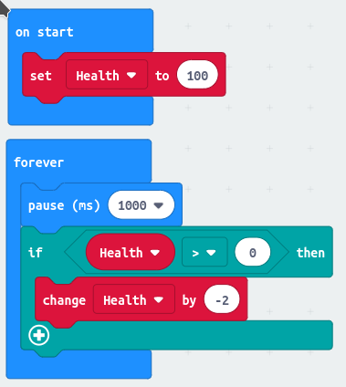
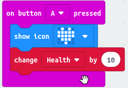
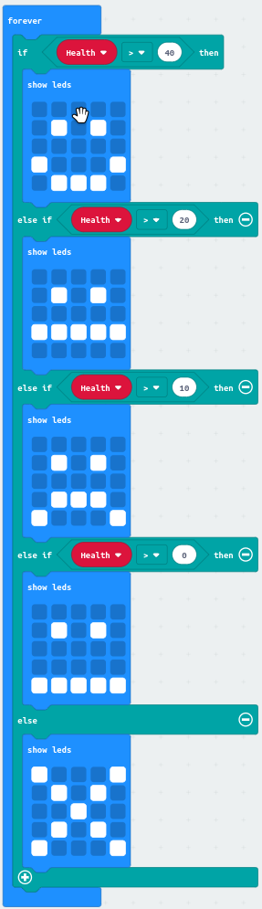
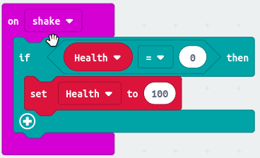
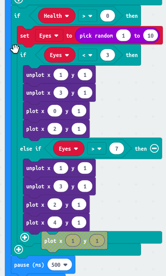

= Tamagotchi - a digital pet

image::tamagotchi.jpg[A Tamagotchi - picture by Tomasz Sienicki, 400]

Tamagotchi, handheld digital pets, were one of the biggest toy fads of the later 1990s
and early 2000s. Over 82 million were sold. They were invented in 1997 in Japan
by Aki Maita.

The owner of the tamagotchi has to look after their pet to keep it alive and help it grow.

== A simple Micro:Bit pet

Let's make a simple pet that we need to keep healthy.
We'll start by making a variable _Health_, which tracks how healthy it is.
Over time, if we don't feed and care for our pet, it will get less healthy.

We can feed and look after our pet by pressing button A.

Of course, we need to see how healthy our pet is.

Finally, if our pet dies, we need to be able to make a new pet.

== A bit of animation

So far your pet doesn't really do much.
Let's make it more interesting to look at by animating it a bit.
I've chosen to make it look to left or right sometimes.
I've added a new section to the end of the _forever_ loop that shows health.

Can you work out what is happening in this bit?
