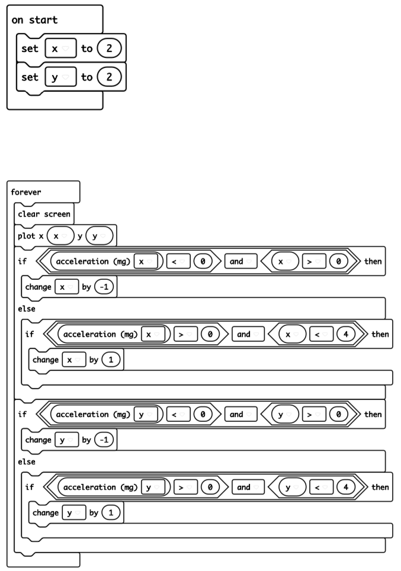
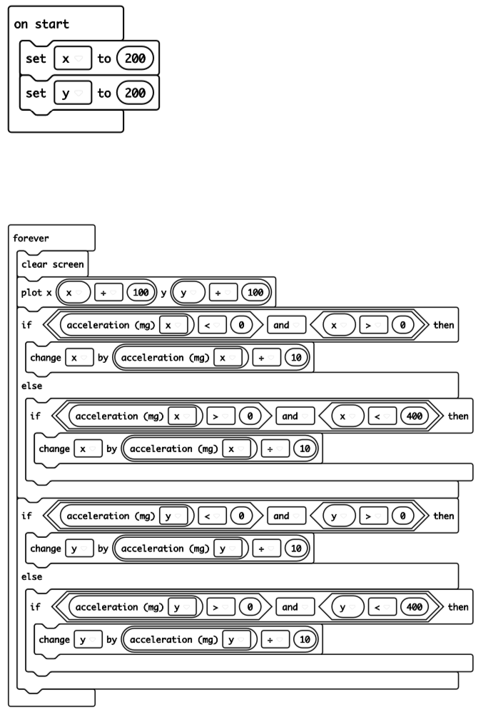

= Wobbly MicroBit

This project explores how to turn on and off individual LEDs on the Micro:Bit,
and using the *accelerometer* in the MicroBit.

So, what's an accelerometer? It's some electronics which tells you if the
Micro:Bit is tilted. On the Micro:Bit you get three basic values `x`, `y` and `z`.
`x` tells you if it's tilted left to right and `y` if it's tilted forward and back.
`z` tells you if the Micro:Bit is going up or down.

Let's make a simple program that lights up a single LED, starting with the middle LED,
and them moves the light around depending on how the Micro:Bit is tilted.

To do this, we'll use the LED `plot` command, which lights up a single LED.
You have to give the command two numbers.

The first number is the column number of the LED you want to light up.
There are 5 columns of LEDs.
Because programmers are a bit strange sometimes, the left hand column is column
number 0, and the right hand column is column number 4.

The second number is the row number.
There are 5 rows of LEDs.
And guess what? The bottom row is row number 0, and the top row is row number 4.

The middle LED is therefore LED (2,2).
So in this program we'll make two variables, `x` to hold the column number, and
`y` to hold the row number.
We'll turn off all the LEDs and turn on the one at our current `x` and `y` position.
Then we'll change `x` and `y` depending on what the accelerometer tells us.

Enter this program, and then play with it.
Can you make the light go to one side and then back to the middle?

When I try this program, I find it very difficult - in fact nearly impossible - to
bring the light back to the middle.
Can you do it?

The problem is that the accelerometer is too sensitive, and we're always moving
by a whole row or column at once.
Here's another version of the program.
This one tries to make it movement less sensitive.
Can you get the light back to the middle with this one?

